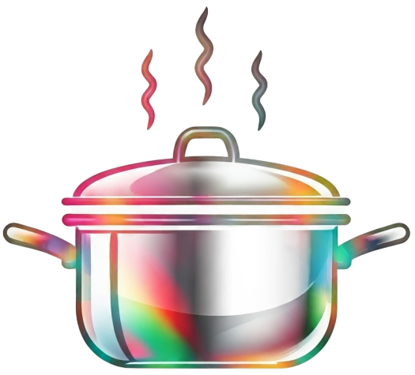

<h1 align=center>
Prisma
</h1>

  

The Jawel of Information

<h2 align=center>Description</h2>

Prisma es una aplicación móvil desarrollada con _React Native_ que ofrece una experiencia de lectura de noticias única y personalizada. Con un diseño intuitivo y un enfoque en la calidad de la información, **Prisma se ha convertido en la elección preferida para aquellos que buscan estar al día con los eventos más relevantes del mundo.**

**Características principales:**

- **Fuentes confiables:** Acceda a noticias de una amplia variedad de fuentes confiables.
- **Interfaz intuitiva:** Navega fácilmente por las noticias con nuestra interfaz limpia y moderna.
- **Modo oscuro:** Disfruta de una experiencia de lectura más cómoda en entornos con poca luz.
- **Guardado de artículos:** Guarda artículos para leerlos más tarde.

